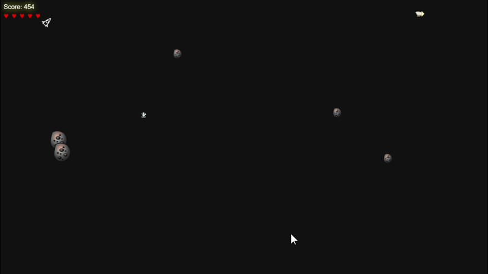

# 🚀 Meteor Dodge

隕石を避けながら宇宙を進む、シンプルでスリリングな横スクロールゲームです。



## 🎮 ゲーム概要

プレイヤーは宇宙船を操作し、飛んでくる隕石を避けながらゴールを目指します。
アイテムを駆使してハイスコアを狙いましょう！

---

## 🕹 操作方法

* ↑キー：上に移動
* ↓キー：下に移動
* スマホ：スワイプ操作対応

---

## 🎯 目的

隕石を避けながら進み、**ゴールに到達すればクリア！**

※ 衝突するとダメージを受け、HPが0でゲームオーバー HPは5個

---

## 💎 アイテム一覧

| アイテム    | 効果         |
| ------- | ---------- |
| シールド    | 一定時間ダメージ無効 |
| スピード    | 移動速度アップ    |
| ダブル     | スコア2倍      |
| スロー     | 隕石の速度低下    |
| スコアブースト | スコア加算      |
| 隕石ブラスター | 隕石を消去      |
| 強化シールド  | 長時間無敵      |

---

## ⚙️ 難易度

* カンタン
* 普通
* 難しい

難易度によって隕石の速度や量が変化します。

---

## ▶️ プレイ方法

[Github Pages版](https://osumu.github.io/meteor)を開くだけで誰でも遊べます!

ローカルで遊びたい場合は：

1. このリポジトリをクローン

```bash
git clone https://github.com/your-username/meteor-dodge.git
```

2. フォルダを開く

3. `index.html` をブラウザで開くだけです!

---

## 🛠 使用技術

* HTML5
* CSS (Bootstrap)
* JavaScript (Canvas API)

---

## 💡 今後の改善案

* スマホUIの最適化
* ボス追加
* スコアランキング（オンライン）
* エフェクト強化

---

## 📄 ライセンス

MIT License（自由に使ってOK）
